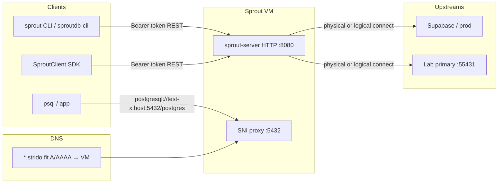
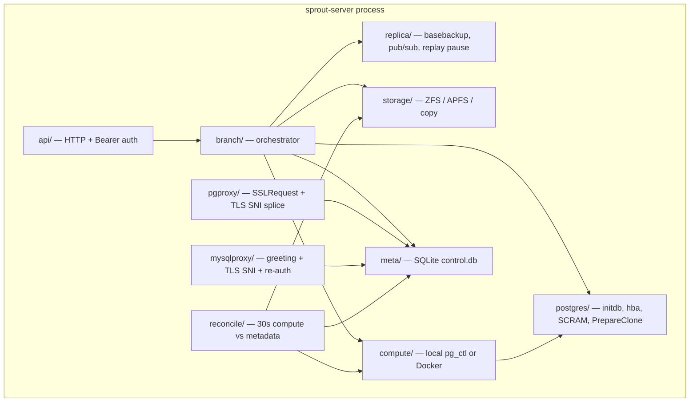
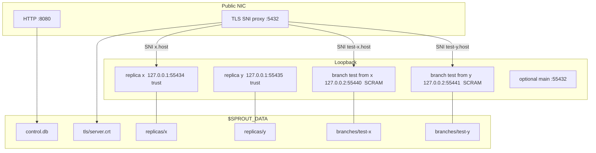
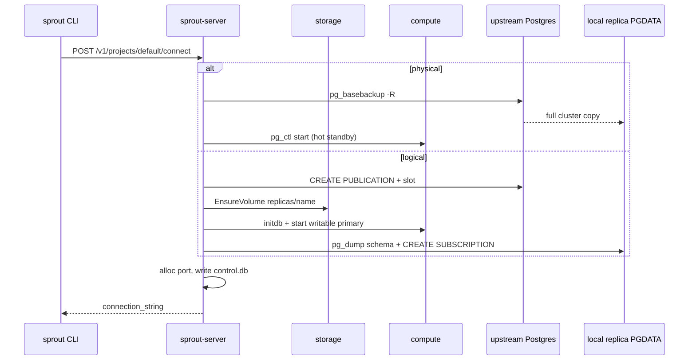
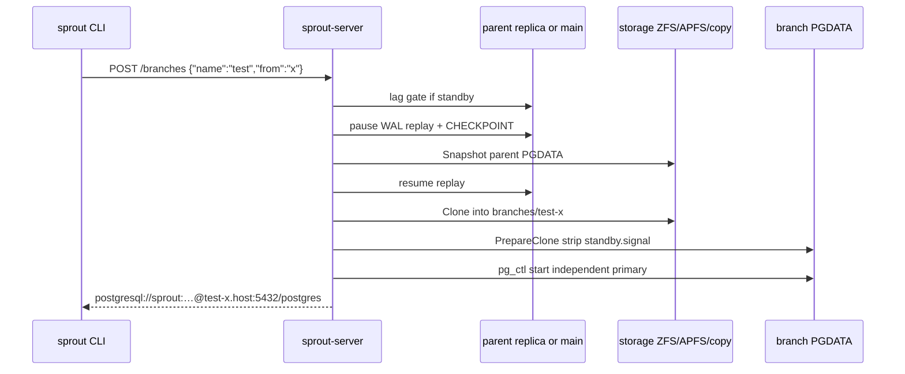
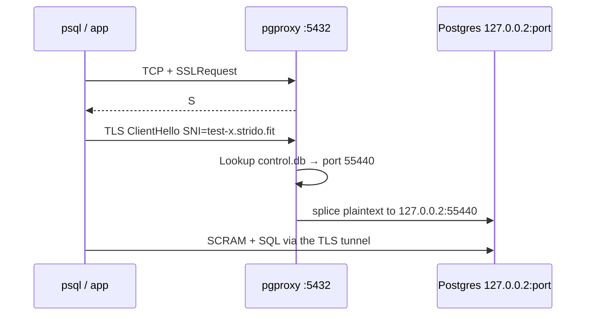
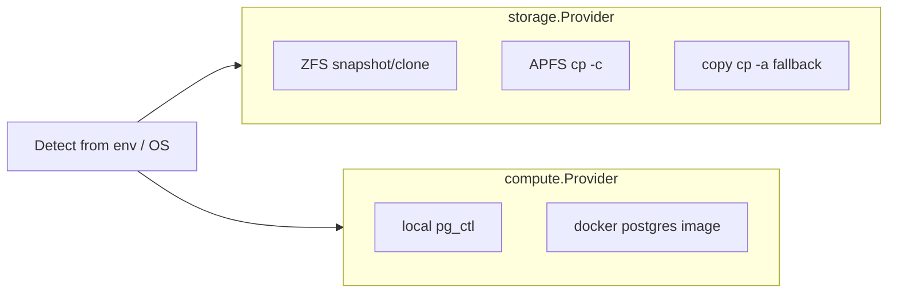

# Sprout architecture

Sprout is a **control plane** for copy-on-write Postgres branching. The server owns replicas, clones, and postmasters. Clients (CLI, npm SDK, `psql`) never touch PGDATA directly.

## 1. System context



Two planes:

| Plane | Port | Who talks | Purpose |
|-------|------|-----------|---------|
| Control | `:8080` | CLI / SDK | connect, branch, suspend, doctor |
| Data | `:5432` Postgres / `:3306` MySQL (domain) or unique ports (localhost / IP) | `psql` / `mysql` / apps | SQL against a replica or branch |

## 2. Inside `sprout-server`

One process. HTTP, the SNI proxy, and the reconciler share the same SQLite notebook and the same data root.



Package map:

```text
cmd/sprout          thin HTTP client (CLI)
cmd/sprout-server   control plane + reconciler + SNI proxy

internal/
  api/        HTTP routes, Bearer auth
  branch/     init / connect / create / lifecycle / doctor
  replica/    pg_basebackup, standby, logical pub/sub
  storage/    APFS / ZFS CoW (copy fallback)
  compute/    local pg_ctl (Docker optional)
  postgres/   initdb, checkpoint, PrepareClone, advertised URLs
  pgproxy/    TLS SNI router on :5432
  mysql/      dump-import + local mysqld
  mysqlproxy/ MySQL hostname router on :3306
  meta/       SQLite → data/control.db
  reconcile/  keep compute vs metadata aligned
  config/     env defaults
```

## 3. Data plane on the VM

Each connector and each branch is a **separate Postgres** with its own PGDATA and loopback port. The proxy is the only public Postgres listener when `SPROUT_PUBLIC_HOST` is a DNS name.



Hostname rule: connectors stay `<name>.host`; branches become `<branch>-<connector>.host` so two `test` branches do not collide.

```text
postgresql://sprout:<pass>@test-x.strido.fit:5432/postgres
postgresql://sprout:<pass>@test-y.strido.fit:5432/postgres
```

`/postgres` is the database inside that instance, not the branch name. Localhost and raw IPs skip the proxy and keep the unique port.

The proxy dials **127.0.0.2** (SCRAM) so it does not inherit stock **127.0.0.1 trust** used by the control plane.

## 4. Connect (named replica)



Physical replicas stay standbys (WAL replay). Logical replicas are writable primaries; branches still CoW that directory.

## 5. Branch create (CoW)



On ZFS, each main / replica / branch is a **child dataset**. Snapshot and clone use those datasets, not the pool root.

## 6. Client SQL through SNI



Disable with `SPROUT_PG_PROXY=false` to advertise unique ports again (no proxy).

MySQL cannot splice the first packets the same way (server-speaks-first; auth salt is per connection). `mysqlproxy` greets, upgrades to TLS for SNI, verifies `mysql_native_password`, logs into `127.0.0.1:<instance port>`, then splices the command phase. Disable with `SPROUT_MYSQL_PROXY=false`.

## 7. Storage and compute



| Layer | Default pick |
|-------|----------------|
| Storage | `SPROUT_ZFS_DATASET` → ZFS; else APFS on macOS; else full copy |
| Compute | local `pg_ctl` so `initdb` and runtime share a major; Docker if `SPROUT_COMPUTE=docker` |

## 8. Reconciler

Every 30s, `internal/reconcile` walks `control.db`:

- Stuck `creating` / `resetting` / `deleting` → error or cleanup
- `active` with dead postmaster → `crashed` (or auto-resume if `SPROUT_AUTO_RESUME=true`)
- Same for connectors

It does not replace the API; it heals process state after a crash.
